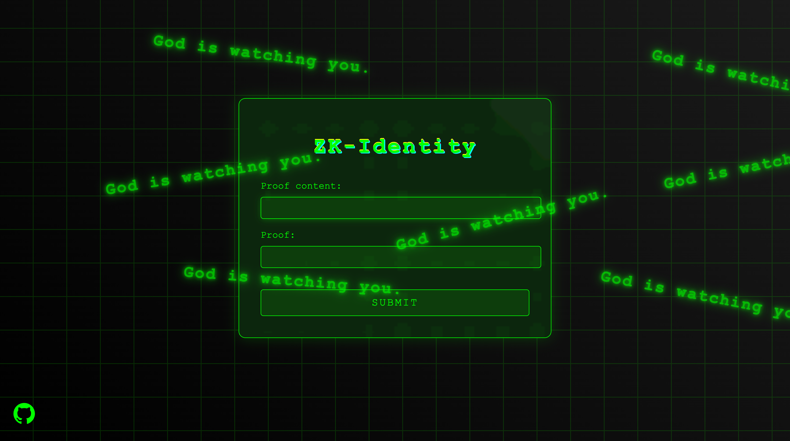

- 前情提要：懒羊羊最近仔准备期末考试，开发进度可能暂缓解（悲）
# ZK-Identity

这是一个基于零知识证明技术的实验性项目集合，专注于探索和实现各种身份认证场景。目前正在进行学生身份认证的原型开发，这只是整个项目的起点。

## 项目愿景
建立一个完整的零知识证明实验场，让开发者能够：
- 快速实现各类身份认证场景
- 探索零知识证明的各种可能性
- 构建实用的隐私保护解决方案

## 当前进展
- [x] 合约部分
- [x] 电路部分
- [ ] 前端部分
- [ ] 后端部分
### 学生身份认证模块
- 证明学生属于特定学院，无需披露具体身份
- 基于Circom实现核心电路
- 智能合约验证整合，实现链上验证逻辑。
### 前端

### 前端贡献流程

如果你对本项目的前端部分感兴趣并希望贡献代码，可以参考我们的[前端贡献流程](https://github.com/oftiyf/ZK-Identity/tree/main/front_end#readme)。该流程详细介绍了如何参与前端开发，包括环境配置、开发流程以及提交代码的规范。我们欢迎任何形式的贡献，无论是界面优化、用户体验提升还是新增功能的开发。

## 未来规划

### 近期目标
1. **完善学生身份认证模块**：
   - 添加更多身份属性（如年级、专业）。
   - 优化电路设计，提升性能。
   - 开发直观的用户界面。

2. **扩展应用场景**：
   - 年龄验证。
   - 会员资格证明。
   - 学历认证。
   - 专业资格认证。
3. **技术栈完善**：
   - 完成前端界面开发。
   - 搭建后端服务，支持数据交互与零知识证明生成。
   - 智能合约优化，提升链上验证效率。

## 技术架构
- 零知识证明：Circom + Snarkjs
- 智能合约：Solidity
- 区块链：Ethereum
- 前端：规划中
- 后端：规划中

## 参与贡献
我们欢迎各种形式的贡献：
- 新的身份验证场景构想
- 电路设计优化建议
- 应用场景扩展
- 代码改进

## 联系方式
- Issue提交：直接在GitHub提交issue
- 邮件讨论：[待补充]
- 社区讨论：[待建立]

## 愿景
打造一个开放的零知识证明实验平台，推动隐私保护技术在身份认证领域的应用和创新。我们相信，通过社区的力量，可以探索出更多有价值的应用场景和解决方案。

## 致谢
感谢所有为项目做出贡献的开发者，以及Circom和Snarkjs等开源项目的支持。

## License
MIT

---
注：本项目仍在积极开发中，欢迎感兴趣的开发者参与贡献和讨论。